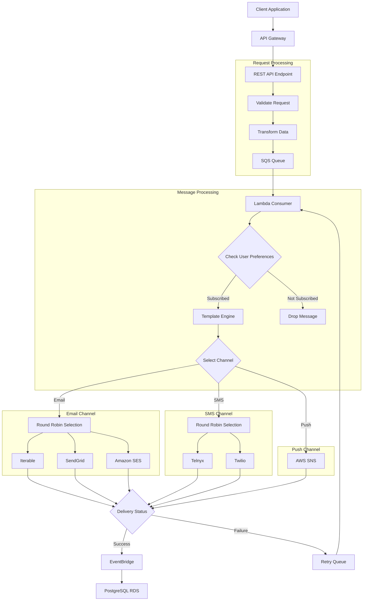
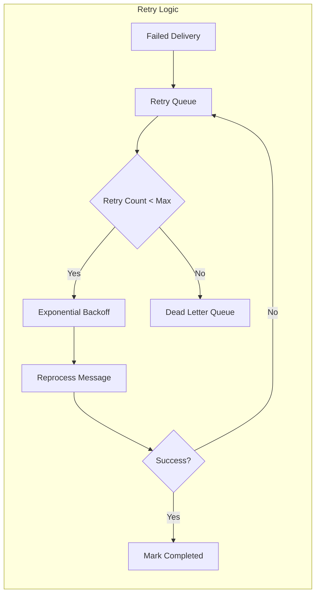
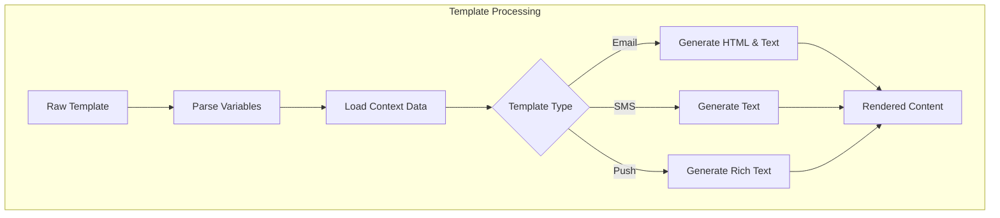
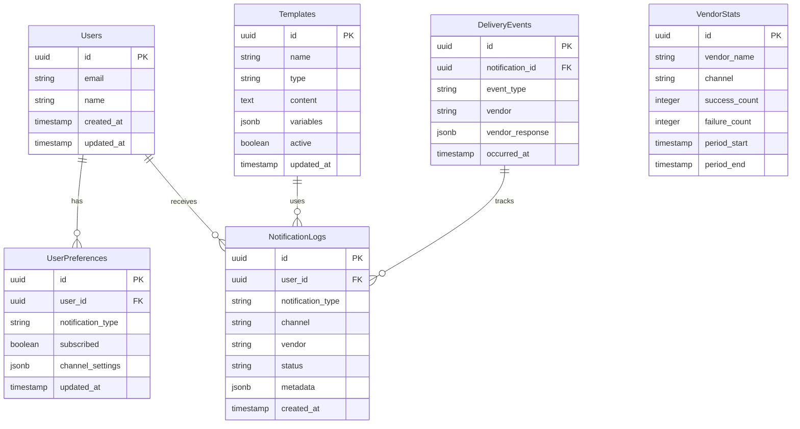
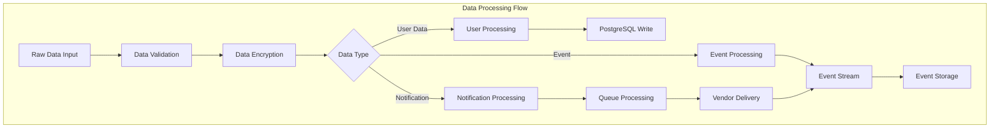
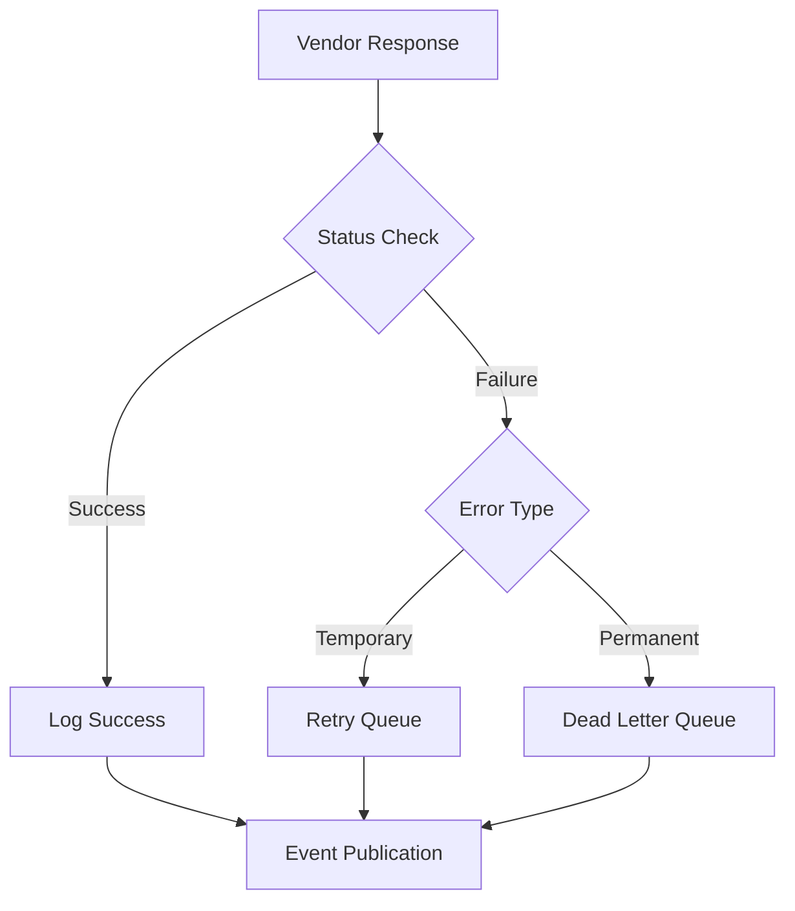

# Product Requirements Document (PRD)

# 1. INTRODUCTION

## 1.1 Purpose

This Product Requirements Document (PRD) specifies the requirements for developing a high-throughput, multi-channel Notification Service. The document serves as a comprehensive guide for software developers, system architects, project managers, and stakeholders involved in the implementation and maintenance of the system. It provides detailed technical specifications, architectural decisions, and implementation guidelines to ensure successful delivery of the service.

## 1.2 Scope

The Notification Service is designed to be a robust, scalable system that enables the delivery of notifications across multiple channels, including Email, SMS, Chat, and Push Notifications. The system will:

- Provide a RESTful API endpoint for notification submission
- Support multiple notification delivery vendors with round-robin load balancing
- Process hundreds of thousands of requests per minute
- Handle template-based content generation
- Templates should be multi-lingual and possible to localise
- Ensure reliable message delivery with retry mechanisms
- Track notification delivery events
- Store user preferences and notification logs

Key benefits include:

- Asynchronous processing for improved performance
- Vendor redundancy for increased reliability
- Template-based content management
- Scalable AWS-based infrastructure
- Comprehensive event tracking and monitoring
- Fault-tolerant design with graceful degradation

The service will be built using:

- AWS services (API Gateway, Lambda, SQS, RDS, SNS, EventBridge)
- PHP for backend processing
- PostgreSQL for data persistence
- Terraform for infrastructure deployment

# 2. PRODUCT DESCRIPTION

## 2.1 Product Perspective

The Notification Service operates as a standalone microservice within a larger enterprise ecosystem. It interfaces with:

- Client applications via RESTful API endpoints
- Multiple third-party notification vendors (Iterable, SendGrid, Amazon SES, Telnyx, Twilio)
- AWS infrastructure services (API Gateway, Lambda, SQS, RDS, SNS, EventBridge)
- Enterprise monitoring and logging systems
- Existing user management systems for preference data

## 2.2 Product Functions

The Notification Service provides these core functions:

- Notification submission through RESTful API endpoints
- Multi-channel message delivery (Email, SMS, Chat, Push)
- Template-based content generation and management
- Vendor load balancing and failover handling
- User preference management
- Delivery status tracking and event logging
- Queue-based asynchronous processing
- Real-time delivery status updates
- Notification history and audit trails

## 2.3 User Characteristics

### Technical Integration Teams

- Software engineers and developers
- Experience with RESTful APIs
- Familiar with JSON payload structures
- Capable of implementing retry logic and error handling

### System Administrators

- DevOps engineers
- AWS infrastructure expertise
- Monitoring and maintenance capabilities
- Understanding of distributed systems

### End Users (Indirect)

- Receive notifications across multiple channels
- Various technical proficiency levels
- Different device and platform preferences
- Global user base with different language requirements

## 2.4 Constraints

### Technical Constraints

- AWS ecosystem limitations and service quotas
- Vendor API rate limits and throughput restrictions
- PHP version compatibility requirements
- PostgreSQL performance boundaries
- Network latency considerations

### Business Constraints

- Vendor contract limitations
- Budget restrictions for third-party services
- Compliance with data protection regulations
- Service Level Agreement (SLA) requirements
- Message delivery time expectations

### Security Constraints

- Data encryption requirements
- Authentication and authorization protocols
- Audit trail maintenance
- Personal data handling restrictions
- Vendor security compliance requirements

## 2.5 Assumptions and Dependencies

### Assumptions

- Stable AWS service availability
- Reliable vendor API uptime
- Sufficient network bandwidth
- Valid user contact information
- Proper template formatting
- Consistent message payload structure

### Dependencies

- AWS service availability
- Third-party vendor services
- Network connectivity
- User management system
- Template management system
- Infrastructure as Code (Terraform) deployment tools
- PHP runtime environment
- PostgreSQL database system
- Monitoring and logging systems

# 3. PROCESS FLOWCHART







# 4. FUNCTIONAL REQUIREMENTS

## 4.1 API Integration (F1)

### ID

F1

### Description

RESTful API endpoint for submitting notification requests across multiple channels

### Priority

P0 (Critical)

### Requirements Table

| Requirement ID | Requirement Description | Acceptance Criteria |
| --- | --- | --- |
| F1.1 | Accept POST requests with JSON payload | - Validates required fields<br>- Returns 202 Accepted response<br>- Proper error handling with appropriate status codes |
| F1.2 | Process notification metadata | - Validates email format<br>- Validates phone numbers<br>- Checks notification type validity |
| F1.3 | Transform API request to queue message | - Maintains all necessary request data<br>- Adds system metadata<br>- Generates unique tracking ID |

## 4.2 Queue Management (F2)

### ID

F2

### Description

SQS-based queuing system for asynchronous notification processing

### Priority

P0 (Critical)

### Requirements Table

| Requirement ID | Requirement Description | Acceptance Criteria |
| --- | --- | --- |
| F2.1 | Handle high-throughput message ingestion | - Process 100k+ messages per minute<br>- Maintain FIFO when needed<br>- Handle message deduplication |
| F2.2 | Implement dead-letter queue | - Configure max retry attempts<br>- Move failed messages to DLQ<br>- Maintain original message attributes |
| F2.3 | Message batch processing | - Optimize Lambda consumption<br>- Configure appropriate batch size<br>- Handle partial batch failures |

## 4.3 Template Processing (F3)

### ID

F3

### Description

Dynamic content generation using template engine

### Priority

P1 (High)

### Requirements Table

| Requirement ID | Requirement Description | Acceptance Criteria |
| --- | --- | --- |
| F3.1 | Support multiple template formats | - HTML email templates<br>- Plain text templates<br>- Rich push notification templates |
| F3.2 | Variable substitution | - Process context data<br>- Handle missing variables<br>- Support nested objects |
| F3.3 | Template validation | - Syntax checking<br>- Required variable verification<br>- Format-specific validation |

## 4.4 Vendor Integration (F4)

### ID

F4

### Description

Multi-vendor delivery system with load balancing

### Priority

P1 (High)

### Requirements Table

| Requirement ID | Requirement Description | Acceptance Criteria |
| --- | --- | --- |
| F4.1 | Round-robin vendor selection | - Equal distribution among vendors<br>- Vendor health checking<br>- Automatic failover |
| F4.2 | Vendor-specific formatting | - Transform content for each vendor<br>- Handle vendor-specific requirements<br>- Maintain delivery tracking |
| F4.3 | Rate limit management | - Respect vendor API limits<br>- Queue throttling<br>- Backpressure handling |

## 4.5 Event Tracking (F5)

### ID

F5

### Description

Comprehensive delivery status tracking and logging

### Priority

P2 (Medium)

### Requirements Table

| Requirement ID | Requirement Description | Acceptance Criteria |
| --- | --- | --- |
| F5.1 | Capture delivery events | - Track send attempts<br>- Record delivery status<br>- Store vendor responses |
| F5.2 | Event persistence | - Write to PostgreSQL<br>- Handle concurrent writes<br>- Maintain audit trail |
| F5.3 | Real-time status updates | - Publish to EventBridge<br>- Enable status querying<br>- Support webhook callbacks |

## 4.6 User Preference Management (F6)

### ID

F6

### Description

User subscription and preference handling

### Priority

P2 (Medium)

### Requirements Table

| Requirement ID | Requirement Description | Acceptance Criteria |
| --- | --- | --- |
| F6.1 | Store user preferences | - Channel preferences<br>- Notification type opt-ins<br>- Contact information |
| F6.2 | Preference validation | - Check subscription status<br>- Validate contact details<br>- Handle preference updates |
| F6.3 | Preference application | - Apply during processing<br>- Handle preference conflicts<br>- Support override flags |

# 5. NON-FUNCTIONAL REQUIREMENTS

## 5.1 Performance Requirements

| Requirement | Description | Target Metric |
| --- | --- | --- |
| Response Time | API endpoint response time | \< 200ms for 99th percentile |
| Queue Processing | Message processing latency | \< 30 seconds for 95% of messages |
| Throughput | System-wide message processing capacity | 100,000+ messages per minute |
| Database Performance | Write operations per second | 1,000+ concurrent writes |
| Template Processing | Content generation time | \< 100ms per template |
| Resource Utilization | Lambda function memory usage | \< 512MB per instance |
| API Concurrency | Simultaneous API requests | 5,000+ concurrent connections |

## 5.2 Safety Requirements

| Requirement | Description | Implementation |
| --- | --- | --- |
| Data Backup | Regular database backups | Daily full backup, 5-minute incremental |
| Disaster Recovery | Recovery Point Objective (RPO) | \< 5 minutes data loss |
| System Recovery | Recovery Time Objective (RTO) | \< 30 minutes downtime |
| Circuit Breaking | Vendor failure isolation | Automatic circuit breaking after 5 failures |
| Message Persistence | Queue message retention | 14 days retention period |
| Failover Mechanism | Multi-AZ deployment | Automatic failover \< 60 seconds |
| Data Integrity | Message consistency checks | SHA-256 hash verification |

## 5.3 Security Requirements

| Requirement | Description | Implementation |
| --- | --- | --- |
| Authentication | API access control | JWT-based authentication |
| Authorization | Role-based access control | IAM policies and roles |
| Data Encryption | Data protection | TLS 1.3 in transit, AES-256 at rest |
| API Security | Request validation | WAF rules, request throttling |
| Audit Logging | Security event tracking | CloudWatch Logs with 1-year retention |
| Secrets Management | Credential protection | AWS Secrets Manager integration |
| Vendor Security | Third-party security | SOC 2 Type II compliance required |

## 5.4 Quality Requirements

### 5.4.1 Availability

- Service uptime: 99.95% monthly
- Multi-AZ deployment in AWS
- Automated health checks every 30 seconds
- Maximum planned downtime: 4 hours annually

### 5.4.2 Maintainability

- Code coverage: Minimum 80%
- Documentation: OpenAPI 3.0 specification
- Monitoring: CloudWatch dashboards
- Logging: Structured JSON format

### 5.4.3 Usability

- API versioning support
- Comprehensive error messages
- SDK support for PHP and JavaScript
- Self-service documentation portal

### 5.4.4 Scalability

- Auto-scaling Lambda functions
- Horizontal database scaling
- Queue capacity auto-expansion
- Multi-region deployment support

### 5.4.5 Reliability

- Message delivery rate: 99.9%
- Retry mechanism: 3 attempts with exponential backoff
- Vendor fallback: Maximum 2-second failover
- Data consistency: Eventually consistent model

## 5.5 Compliance Requirements

| Requirement | Description | Implementation |
| --- | --- | --- |
| GDPR | EU data protection | Data minimization, right to erasure |
| CCPA | California privacy law | Data disclosure, opt-out support |
| HIPAA | Healthcare data (if applicable) | PHI handling procedures |
| SOC 2 | Security controls | Annual audit compliance |
| ISO 27001 | Information security | Security controls framework |
| CAN-SPAM | Email compliance | Unsubscribe mechanism |
| TCPA | SMS compliance | Opt-in verification |

# 6. DATA REQUIREMENTS

## 6.1 Data Models



## 6.2 Data Storage

### 6.2.1 Primary Storage

| Data Type | Storage Solution | Retention Period | Backup Frequency |
| --- | --- | --- | --- |
| User Data | PostgreSQL RDS | Indefinite | Daily full, 5-min incremental |
| Notification Logs | PostgreSQL RDS | 90 days | Daily full, 5-min incremental |
| Templates | PostgreSQL RDS | Indefinite | Daily full, 5-min incremental |
| Delivery Events | PostgreSQL RDS | 30 days | Daily full, 5-min incremental |
| Queue Messages | AWS SQS | 14 days | N/A (managed by AWS) |

### 6.2.2 Redundancy Configuration

| Component | Configuration | Recovery Point |
| --- | --- | --- |
| RDS | Multi-AZ deployment | \< 5 minutes |
| SQS | Cross-region replication | Real-time |
| Templates | Read replicas | \< 1 minute |
| Event Logs | Cross-region backup | \< 15 minutes |

## 6.3 Data Processing



### 6.3.1 Data Security

| Security Layer | Implementation | Purpose |
| --- | --- | --- |
| Encryption at Rest | AES-256 | Database storage |
| Encryption in Transit | TLS 1.3 | API and vendor communication |
| Data Masking | SHA-256 | PII protection |
| Access Control | IAM + RBAC | Authorization |
| Audit Logging | CloudWatch | Security tracking |

### 6.3.2 Data Partitioning

| Table | Partition Key | Partition Strategy |
| --- | --- | --- |
| NotificationLogs | created_at | Monthly partitions |
| DeliveryEvents | occurred_at | Daily partitions |
| VendorStats | period_start | Monthly partitions |
| Templates | type | Hash partitioning |

### 6.3.3 Data Archival

| Data Type | Archive Method | Archive Location | Retention |
| --- | --- | --- | --- |
| Notification Logs | PostgreSQL partitioning | S3 Cold Storage | 7 years |
| Delivery Events | PostgreSQL partitioning | S3 Cold Storage | 2 years |
| User Data | Soft delete | Primary database | Indefinite |
| Templates | Version control | Primary database | All versions |

# 7. EXTERNAL INTERFACES

## 7.1 Software Interfaces

### 7.1.1 Email Service Providers

| Provider | Interface Type | Protocol | Data Format |
| --- | --- | --- | --- |
| Iterable | REST API | HTTPS | JSON |
| SendGrid | REST API | HTTPS | JSON |
| Amazon SES | AWS SDK | HTTPS | JSON |

### 7.1.2 SMS Service Providers

| Provider | Interface Type | Protocol | Data Format |
| --- | --- | --- | --- |
| Telnyx | REST API | HTTPS | JSON |
| Twilio | REST API | HTTPS | JSON |

### 7.1.3 AWS Services

| Service | Interface Type | Protocol | Purpose |
| --- | --- | --- | --- |
| API Gateway | REST API | HTTPS | Request ingestion |
| Lambda | AWS SDK | Internal | Message processing |
| SQS | AWS SDK | Internal | Message queuing |
| SNS | AWS SDK | Internal | Push notifications |
| EventBridge | AWS SDK | Internal | Event routing |
| RDS | PostgreSQL | TCP/IP | Data persistence |

## 7.2 Communication Interfaces

### 7.2.1 API Specifications

```yaml
openapi: 3.0.0
paths:
  /v1/notifications:
    post:
      requestBody:
        content:
          application/json:
            schema:
              type: object
              properties:
                email:
                  type: string
                name:
                  type: string
                notification_type:
                  type: string
                  enum: [EMAIL, SMS, CHAT, PUSH]
                context:
                  type: object
                additional_data:
                  type: object
      responses:
        '202':
          description: Accepted
        '400':
          description: Bad Request
```

### 7.2.2 Message Formats

| Interface | Format | Encoding | Validation |
| --- | --- | --- | --- |
| API Requests | JSON | UTF-8 | JSON Schema |
| Queue Messages | JSON | UTF-8 | Custom |
| Events | JSON | UTF-8 | EventBridge Schema |
| Database | JSONB | UTF-8 | PostgreSQL |

### 7.2.3 Network Protocols

| Protocol | Port | Usage | Security |
| --- | --- | --- | --- |
| HTTPS | 443 | API communication | TLS 1.3 |
| TCP/IP | 5432 | Database connections | TLS 1.3 |
| SMTP | 587 | Email delivery | STARTTLS |

## 7.3 Hardware Interfaces

### 7.3.1 AWS Infrastructure

| Component | Specifications | Scaling |
| --- | --- | --- |
| RDS Instance | db.r6g.xlarge | Auto-scaling storage |
| Lambda Functions | 512MB RAM | Concurrent execution |
| API Gateway | 10,000 RPS | Auto-scaling |
| SQS Queues | Standard | Auto-scaling |

### 7.3.2 Network Requirements

| Requirement | Specification | Notes |
| --- | --- | --- |
| Bandwidth | 1 Gbps minimum | Per AZ |
| Latency | \< 50ms | Between components |
| Network ACLs | Custom VPC | Security groups |

## 7.4 Third-Party Integration Interfaces

### 7.4.1 Vendor Authentication

| Vendor | Auth Method | Token Type | Renewal |
| --- | --- | --- | --- |
| Iterable | API Key | Bearer | Manual |
| SendGrid | API Key | Bearer | Manual |
| Telnyx | API Key | Bearer | Manual |
| Twilio | API Key + Secret | Basic | Manual |

### 7.4.2 Rate Limits

| Vendor | Requests/Second | Burst Limit | Throttling Strategy |
| --- | --- | --- | --- |
| Iterable | 1000 | 2000 | Queue backoff |
| SendGrid | 1500 | 3000 | Queue backoff |
| Telnyx | 100 | 200 | Queue backoff |
| Twilio | 100 | 200 | Queue backoff |

### 7.4.3 Response Handling



# 8. APPENDICES

## 8.1 GLOSSARY

| Term | Definition |
| --- | --- |
| Dead Letter Queue | A queue that stores messages that could not be processed successfully after multiple retries |
| Round Robin | A method of distributing load across multiple vendors in a circular, sequential order |
| Template Engine | Software component that combines templates with data to generate final content |
| Webhook | HTTP callback that delivers real-time information to other applications |
| Circuit Breaker | Design pattern that prevents system failure by stopping operations when errors exceed threshold |
| Backpressure | Mechanism to handle overflow of requests by slowing down processing |
| Eventually Consistent | Data consistency model where all replicas will be consistent after some time |

## 8.2 ACRONYMS

| Acronym | Definition |
| --- | --- |
| API | Application Programming Interface |
| AWS | Amazon Web Services |
| DLQ | Dead Letter Queue |
| FIFO | First In, First Out |
| IAM | Identity and Access Management |
| JWT | JSON Web Token |
| PII | Personally Identifiable Information |
| RBAC | Role-Based Access Control |
| RDS | Relational Database Service |
| REST | Representational State Transfer |
| SDK | Software Development Kit |
| SES | Simple Email Service |
| SMS | Short Message Service |
| SNS | Simple Notification Service |
| SQS | Simple Queue Service |
| TLS | Transport Layer Security |
| VPC | Virtual Private Cloud |
| WAF | Web Application Firewall |

## 8.3 ADDITIONAL REFERENCES

| Resource | Description | URL |
| --- | --- | --- |
| AWS Lambda Documentation | Official AWS Lambda developer guide | https://docs.aws.amazon.com/lambda/ |
| PostgreSQL Documentation | PostgreSQL database manual | https://www.postgresql.org/docs/ |
| Terraform AWS Provider | AWS provider documentation for Terraform | https://registry.terraform.io/providers/hashicorp/aws/latest/docs |
| SendGrid API Reference | SendGrid email service API documentation | https://docs.sendgrid.com/api-reference |
| Twilio API Documentation | Twilio SMS service API documentation | https://www.twilio.com/docs/api |
| Telnyx API Guide | Telnyx messaging API documentation | https://developers.telnyx.com/docs/api |
| Iterable API Documentation | Iterable marketing API documentation | https://api.iterable.com/api/docs |
| OpenAPI Specification | REST API documentation standard | https://spec.openapis.org/oas/latest.html |