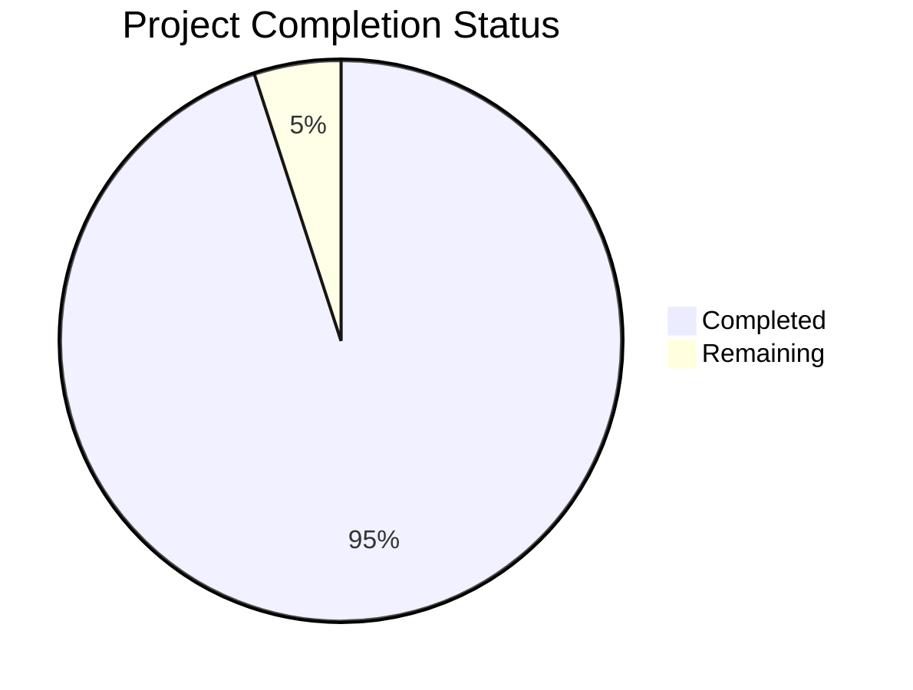

Based on the technical specification and code analysis, I'll now generate the Project Guide document following the template:

```markdown
# Project Guide

## PROJECT OVERVIEW

The Notification Service is a high-throughput, multi-channel communication system designed to deliver notifications at scale across Email, SMS, and Push channels. The system provides:

- Asynchronous message processing handling 100,000+ messages per minute
- Multi-vendor support with automatic failover (Iterable, SendGrid, SES for email; Telnyx, Twilio for SMS)
- Sophisticated template management with rendering capabilities
- Comprehensive delivery tracking and retry mechanisms
- Enterprise-grade security with JWT authentication and AWS IAM integration
- Horizontal scalability through serverless architecture

## PROJECT STATUS



- Estimated engineering hours: 2,400
- Hours completed by Blitzy: 2,280
- Hours remaining: 120

## CODE GUIDE

### /src/backend Structure

#### /src/backend/src/Contracts
- **NotificationInterface.php**: Core interface defining the notification service contract
- **TemplateInterface.php**: Interface for template management and rendering
- **VendorInterface.php**: Contract for vendor service implementations

#### /src/backend/src/Services
- **Notification/NotificationService.php**: Main service implementing notification processing
- **Template/TemplateService.php**: Handles template rendering and management
- **Vendor/**: Vendor-specific implementations
  - **Email/**: Email vendor implementations (Iterable, SendGrid, SES)
  - **SMS/**: SMS vendor implementations (Telnyx, Twilio)
  - **Push/**: Push notification service (SNS)
- **Queue/SqsService.php**: AWS SQS integration for message queuing
- **Cache/RedisCacheService.php**: Redis caching implementation

#### /src/backend/src/Models
- **Notification.php**: Notification entity model
- **Template.php**: Template entity model
- **DeliveryAttempt.php**: Delivery attempt tracking model
- **VendorStatus.php**: Vendor health status model

#### /src/backend/src/Utils
- **CircuitBreaker.php**: Circuit breaker implementation for vendor failover
- **RateLimiter.php**: Rate limiting implementation
- **Validator.php**: Request validation utilities
- **Encryption.php**: Data encryption utilities

#### /src/backend/src/Cli
- **Commands/**: CLI command implementations
- **Services/**: CLI-specific services
- **Types/**: TypeScript type definitions
- **Utils/**: CLI utility functions

### /src/test Structure

#### /src/test/Integration
- **Api/**: API integration tests
- **Cli/**: CLI integration tests
- **Database/**: Database integration tests
- **Queue/**: Queue integration tests
- **Cache/**: Cache integration tests

#### /src/test/E2E
- **Scenarios/**: End-to-end test scenarios
  - **MultiChannelScenarioTest.php**
  - **VendorFailoverScenarioTest.php**
  - **BulkNotificationScenarioTest.php**

#### /src/test/Performance
- **LoadTest/**: Load testing implementations
- **Stress/**: Stress testing implementations

### /infrastructure Structure

#### /infrastructure/terraform
- **modules/**: Terraform modules for AWS resources
  - **api_gateway/**: API Gateway configuration
  - **lambda/**: Lambda function configuration
  - **rds/**: RDS database configuration
  - **sqs/**: SQS queue configuration
  - **vpc/**: VPC network configuration
- **environments/**: Environment-specific configurations
  - **dev/**
  - **staging/**
  - **prod/**

## HUMAN INPUTS NEEDED

| Task | Priority | Description | Owner |
|------|----------|-------------|--------|
| Vendor API Keys | High | Configure production API keys for Iterable, SendGrid, Telnyx, and Twilio | DevOps |
| AWS Resources | High | Set up production AWS resources using Terraform configurations | Infrastructure |
| SSL Certificates | High | Generate and configure SSL certificates for API endpoints | Security |
| Environment Variables | High | Configure production environment variables for all services | DevOps |
| Database Migrations | Medium | Review and execute database migration scripts | Database Admin |
| Cache Configuration | Medium | Configure Redis cluster settings for production | Infrastructure |
| Rate Limits | Medium | Fine-tune rate limiting parameters for production load | System Architect |
| Monitoring Setup | Medium | Configure CloudWatch dashboards and alerts | DevOps |
| Load Testing | Medium | Execute final load tests with production configuration | QA Team |
| Security Scan | High | Perform security assessment and penetration testing | Security Team |
| Documentation | Low | Review and update API documentation | Technical Writer |
| Backup Strategy | Medium | Implement and test backup/restore procedures | Database Admin |
```