# Technical Specifications

# 1. INTRODUCTION

## 1.1 EXECUTIVE SUMMARY

The Notification Service is a high-throughput, multi-channel communication system designed to deliver notifications at scale across Email, SMS, Chat, and Push channels. This system addresses the critical business need for reliable, scalable message delivery while providing vendor redundancy and sophisticated template management. The service will support enterprise teams requiring guaranteed message delivery, serving both technical integration teams and system administrators while impacting end-users through improved communication reliability.

The system delivers value through asynchronous processing capabilities, handling hundreds of thousands of requests per minute, while ensuring message delivery through intelligent retry mechanisms and vendor failover strategies. This robust architecture significantly reduces notification delivery failures and provides comprehensive tracking for all communication attempts.

## 1.2 SYSTEM OVERVIEW

### Project Context

| Aspect | Description |
| --- | --- |
| Business Context | Enterprise-grade notification infrastructure supporting multiple business units |
| Market Position | Core infrastructure service enabling customer communications |
| Current Limitations | Lack of unified notification system, vendor lock-in, limited scalability |
| Enterprise Integration | Interfaces with existing user management and monitoring systems |

### High-Level Description

| Component | Implementation |
| --- | --- |
| API Layer | RESTful endpoints via AWS API Gateway |
| Processing Engine | AWS Lambda functions with SQS queuing |
| Storage Layer | PostgreSQL on AWS RDS (Serverless) |
| Notification Channels | Email (Iterable, SendGrid, SES), SMS (Telnyx, Twilio), Push (SNS) |
| Event Tracking | AWS EventBridge with PostgreSQL persistence |

### Success Criteria

| Metric | Target |
| --- | --- |
| Message Throughput | 100,000+ messages per minute |
| Delivery Success Rate | 99.9% successful delivery |
| System Availability | 99.95% uptime |
| Vendor Failover Time | \< 2 seconds |
| Message Processing Latency | \< 30 seconds for 95th percentile |
| Test coverage | 100% coverage with PHP unit tests |

## 1.3 SCOPE

### In-Scope

#### Core Features and Functionalities

| Feature Category | Components |
| --- | --- |
| API Capabilities | - RESTful endpoint for notification submission<br>- Template management<br>- Delivery status tracking |
| Processing | - Asynchronous message handling<br>- Template rendering<br>- Vendor load balancing |
| Channels | - Email delivery<br>- SMS messaging<br>- Push notifications |
| Monitoring | - Delivery tracking<br>- Performance metrics<br>- System health monitoring |
| Testing | - unit tests |

#### Implementation Boundaries

| Boundary Type | Coverage |
| --- | --- |
| System Integration | AWS service ecosystem |
| User Groups | Enterprise development teams |
| Geographic Coverage | Global deployment |
| Data Domains | Notification metadata, user preferences, delivery events |

### Out-of-Scope

- Voice call notifications
- Real-time chat system implementation
- Custom vendor integration development
- End-user notification preference UI
- Historical data migration
- Custom reporting tools
- Manual notification creation interface
- Direct end-user authentication

# 2. SYSTEM ARCHITECTURE

## 2.1 High-Level Architecture

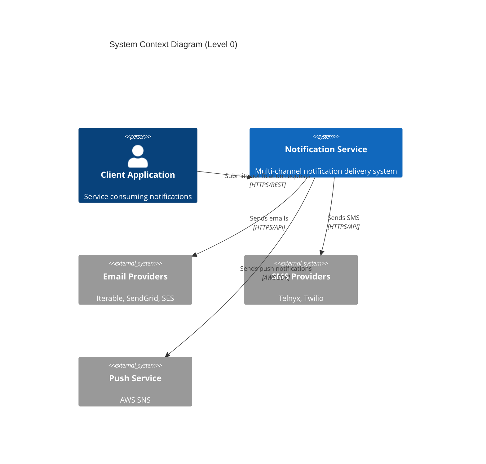
```mermaid
C4Context
    title System Context Diagram (Level 0)
    
    Person(client, "Client Application", "Service consuming notifications")
    System(notification, "Notification Service", "Multi-channel notification delivery system")
    
    System_Ext(email, "Email Providers", "Iterable, SendGrid, SES")
    System_Ext(sms, "SMS Providers", "Telnyx, Twilio")
    System_Ext(push, "Push Service", "AWS SNS")
    
    Rel(client, notification, "Submits notification requests", "HTTPS/REST")
    Rel(notification, email, "Sends emails", "HTTPS/API")
    Rel(notification, sms, "Sends SMS", "HTTPS/API")
    Rel(notification, push, "Sends push notifications", "AWS SDK")
```

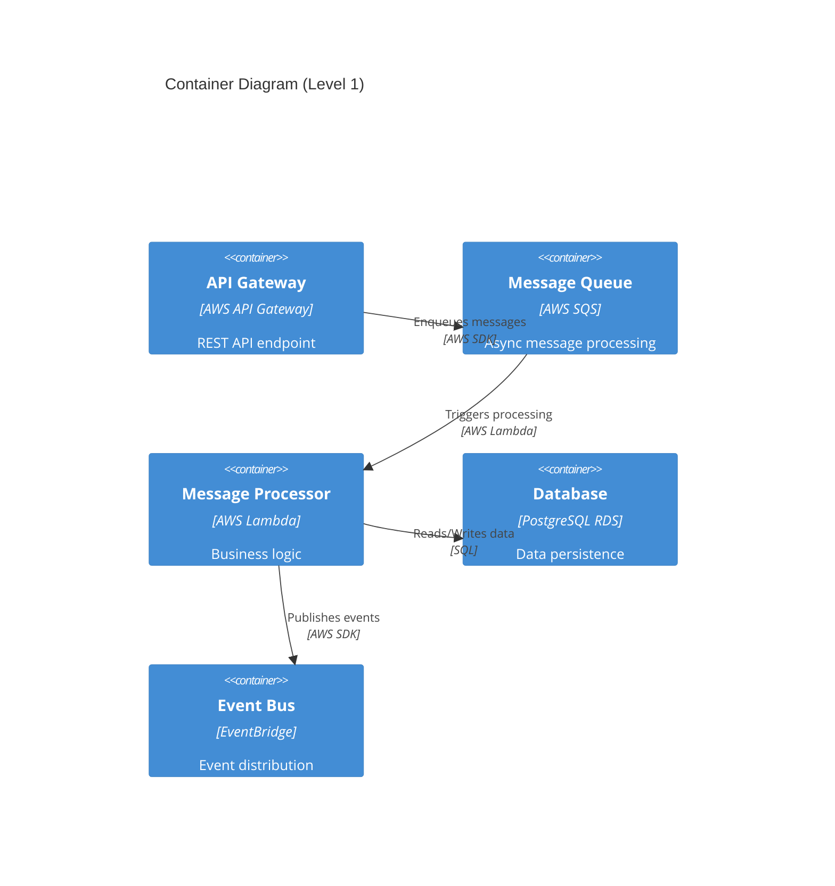
```mermaid
C4Container
    title Container Diagram (Level 1)
    
    Container(api, "API Gateway", "AWS API Gateway", "REST API endpoint")
    Container(queue, "Message Queue", "AWS SQS", "Async message processing")
    Container(processor, "Message Processor", "AWS Lambda", "Business logic")
    Container(db, "Database", "PostgreSQL RDS", "Data persistence")
    Container(events, "Event Bus", "EventBridge", "Event distribution")
    
    Rel(api, queue, "Enqueues messages", "AWS SDK")
    Rel(queue, processor, "Triggers processing", "AWS Lambda")
    Rel(processor, db, "Reads/Writes data", "SQL")
    Rel(processor, events, "Publishes events", "AWS SDK")
```

## 2.2 Component Details

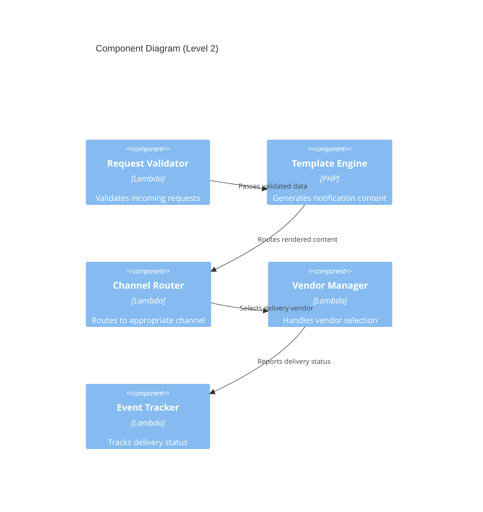
```mermaid
C4Component
    title Component Diagram (Level 2)
    
    Component(validator, "Request Validator", "Lambda", "Validates incoming requests")
    Component(template, "Template Engine", "PHP", "Generates notification content")
    Component(router, "Channel Router", "Lambda", "Routes to appropriate channel")
    Component(vendor, "Vendor Manager", "Lambda", "Handles vendor selection")
    Component(tracker, "Event Tracker", "Lambda", "Tracks delivery status")
    
    Rel(validator, template, "Passes validated data")
    Rel(template, router, "Routes rendered content")
    Rel(router, vendor, "Selects delivery vendor")
    Rel(vendor, tracker, "Reports delivery status")
```

## 2.3 Technical Decisions

| Aspect | Decision | Justification |
| --- | --- | --- |
| Architecture Style | Event-driven Microservices | Enables scalability, loose coupling, and independent scaling |
| Communication | Asynchronous via SQS | Handles high throughput, provides buffering |
| Data Storage | PostgreSQL RDS | ACID compliance, JSON support, scalability |
| Caching | Redis ElastiCache | High-performance template and user preference caching |
| Security | JWT + IAM | Industry standard authentication, AWS native security |

## 2.4 Cross-Cutting Concerns

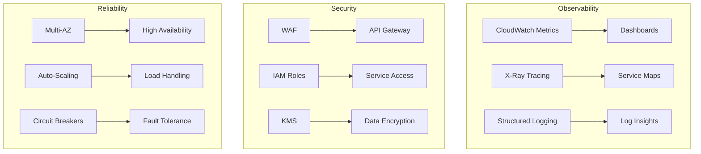
```mermaid
flowchart TD
    subgraph Observability
        A[CloudWatch Metrics] --> B[Dashboards]
        C[X-Ray Tracing] --> D[Service Maps]
        E[Structured Logging] --> F[Log Insights]
    end
    
    subgraph Security
        G[WAF] --> H[API Gateway]
        I[IAM Roles] --> J[Service Access]
        K[KMS] --> L[Data Encryption]
    end
    
    subgraph Reliability
        M[Multi-AZ] --> N[High Availability]
        O[Auto-Scaling] --> P[Load Handling]
        Q[Circuit Breakers] --> R[Fault Tolerance]
    end
```

## 2.5 Deployment Architecture

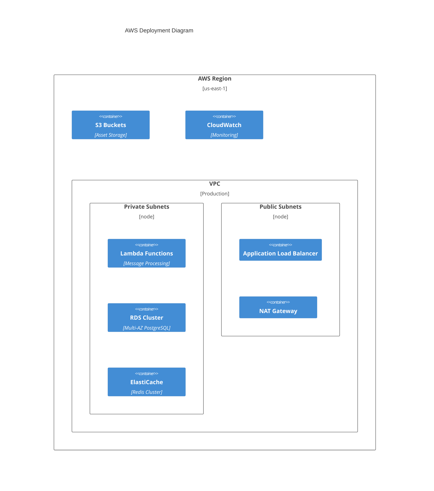
```mermaid
C4Deployment
    title AWS Deployment Diagram
    
    Deployment_Node(region, "AWS Region", "us-east-1"){
        Deployment_Node(vpc, "VPC", "Production"){
            Deployment_Node(private, "Private Subnets"){
                Container(lambda, "Lambda Functions", "Message Processing")
                Container(rds, "RDS Cluster", "Multi-AZ PostgreSQL")
                Container(cache, "ElastiCache", "Redis Cluster")
            }
            Deployment_Node(public, "Public Subnets"){
                Container(alb, "Application Load Balancer")
                Container(nat, "NAT Gateway")
            }
        }
        Container(s3, "S3 Buckets", "Asset Storage")
        Container(cloudwatch, "CloudWatch", "Monitoring")
    }
```

## 2.6 Data Flow

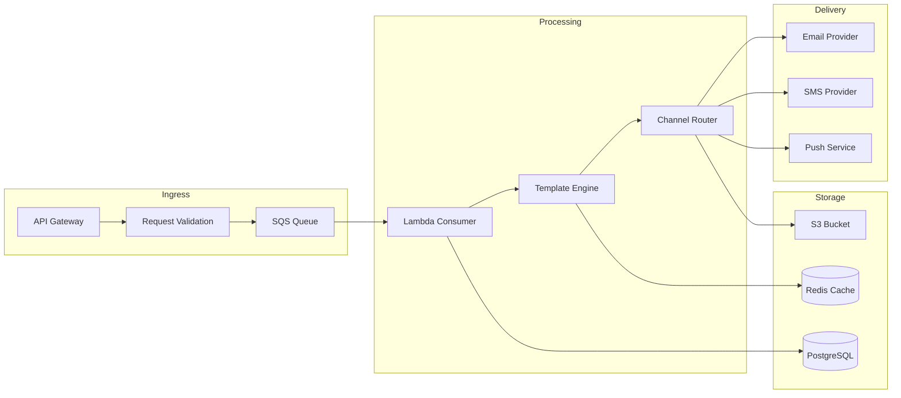
```mermaid
flowchart LR
    subgraph Ingress
        A[API Gateway] --> B[Request Validation]
        B --> C[SQS Queue]
    end
    
    subgraph Processing
        C --> D[Lambda Consumer]
        D --> E[Template Engine]
        E --> F[Channel Router]
    end
    
    subgraph Storage
        G[(PostgreSQL)]
        H[(Redis Cache)]
        I[S3 Bucket]
    end
    
    subgraph Delivery
        J[Email Provider]
        K[SMS Provider]
        L[Push Service]
    end
    
    F --> J & K & L
    D --> G
    E --> H
    F --> I
```

# 3. SYSTEM COMPONENTS ARCHITECTURE

## 3.1 USER INTERFACE DESIGN

### 3.1.1 CLI Application Design

| Component | Specification | Implementation |
| --- | --- | --- |
| Command Structure | `notify [channel] [options]` | Primary command with subcommands |
| Global Flags | `--verbose`, `--config`, `--format` | Consistent across all commands |
| Output Formats | JSON, Table, Plain Text | Configurable via `--format` flag |
| Error Levels | INFO, WARN, ERROR, DEBUG | Standard logging levels |
| Help System | Built-in documentation | Auto-generated from command specs |

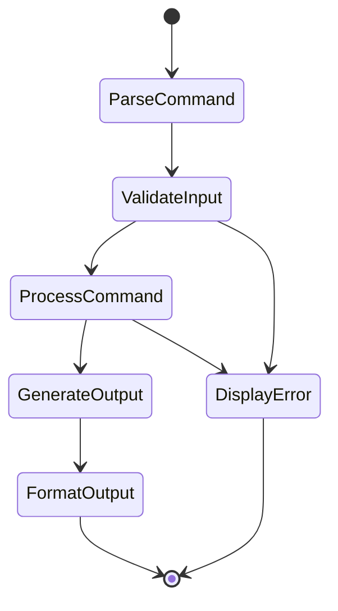
```mermaid
stateDiagram-v2
    [*] --> ParseCommand
    ParseCommand --> ValidateInput
    ValidateInput --> ProcessCommand
    ProcessCommand --> GenerateOutput
    GenerateOutput --> FormatOutput
    FormatOutput --> [*]
    
    ValidateInput --> DisplayError
    ProcessCommand --> DisplayError
    DisplayError --> [*]
```

#### Command Structure

| Command | Purpose | Options |
| --- | --- | --- |
| `notify send` | Send notification | `--template`, `--recipient`, `--channel` |
| `notify status` | Check delivery status | `--id`, `--format` |
| `notify template` | Manage templates | `--list`, `--create`, `--update`, `--delete` |
| `notify config` | Configure settings | `--set`, `--get`, `--list` |

#### Error Handling

| Error Level | Format | Example |
| --- | --- | --- |
| ERROR | `ERROR: [code] message` | `ERROR: [NOT_FOUND] Template does not exist` |
| WARN | `WARN: message` | `WARN: Rate limit approaching` |
| INFO | `INFO: message` | `INFO: Notification queued` |
| DEBUG | `DEBUG: detail` | `DEBUG: API response received` |

## 3.2 DATABASE DESIGN

### 3.2.1 Schema Design

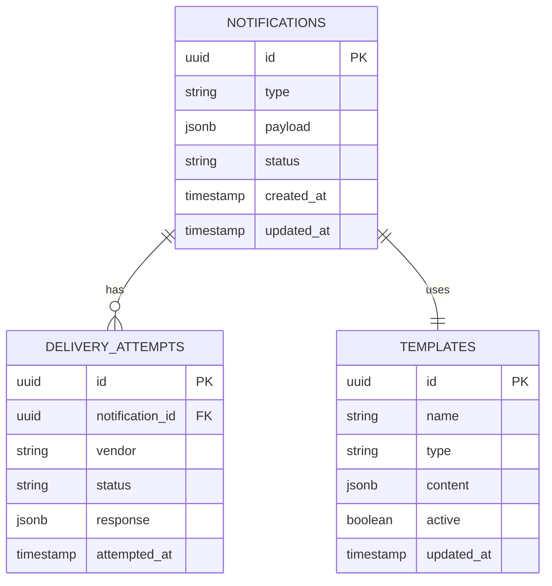
```mermaid
erDiagram
    NOTIFICATIONS {
        uuid id PK
        string type
        jsonb payload
        string status
        timestamp created_at
        timestamp updated_at
    }
    
    TEMPLATES {
        uuid id PK
        string name
        string type
        jsonb content
        boolean active
        timestamp updated_at
    }
    
    DELIVERY_ATTEMPTS {
        uuid id PK
        uuid notification_id FK
        string vendor
        string status
        jsonb response
        timestamp attempted_at
    }
    
    NOTIFICATIONS ||--o{ DELIVERY_ATTEMPTS : has
    NOTIFICATIONS ||--|| TEMPLATES : uses
```

### 3.2.2 Table Specifications

| Table | Partitioning | Indexes | Retention |
| --- | --- | --- | --- |
| notifications | By created_at (monthly) | - status, type (btree)<br>- created_at (brin) | 90 days |
| templates | None | - name, type (btree)<br>- active (btree) | Indefinite |
| delivery_attempts | By attempted_at (daily) | - notification_id (btree)<br>- status, vendor (btree) | 30 days |

### 3.2.3 Performance Optimization

| Aspect | Strategy | Implementation |
| --- | --- | --- |
| Query Optimization | - Materialized views<br>- Partial indexes<br>- Parallel query | - Daily aggregations<br>- Status-based indexes<br>- 4 parallel workers |
| Caching | - Redis cache<br>- Template caching<br>- Result caching | - 1 hour TTL<br>- LRU eviction<br>- 512MB cache size |
| Scaling | - Read replicas<br>- Connection pooling<br>- Statement pooling | - 2 read replicas<br>- 100 connections<br>- pgBouncer |

## 3.3 API DESIGN

### 3.3.1 API Architecture

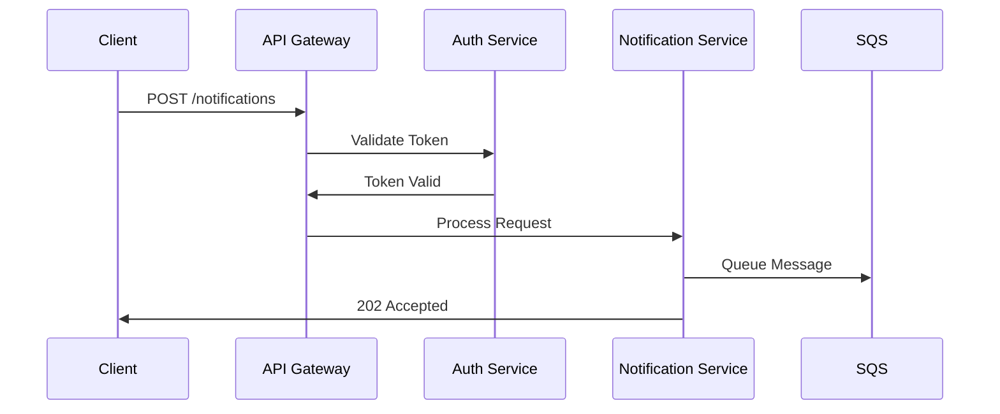
```mermaid
sequenceDiagram
    participant C as Client
    participant G as API Gateway
    participant A as Auth Service
    participant N as Notification Service
    participant Q as SQS
    
    C->>G: POST /notifications
    G->>A: Validate Token
    A->>G: Token Valid
    G->>N: Process Request
    N->>Q: Queue Message
    N->>C: 202 Accepted
```

### 3.3.2 Endpoint Specifications

| Endpoint | Method | Purpose | Rate Limit |
| --- | --- | --- | --- |
| `/v1/notifications` | POST | Submit notification | 1000/min |
| `/v1/notifications/{id}` | GET | Get status | 2000/min |
| `/v1/templates` | POST | Create template | 100/min |
| `/v1/templates/{id}` | PUT | Update template | 100/min |

### 3.3.3 Request/Response Formats

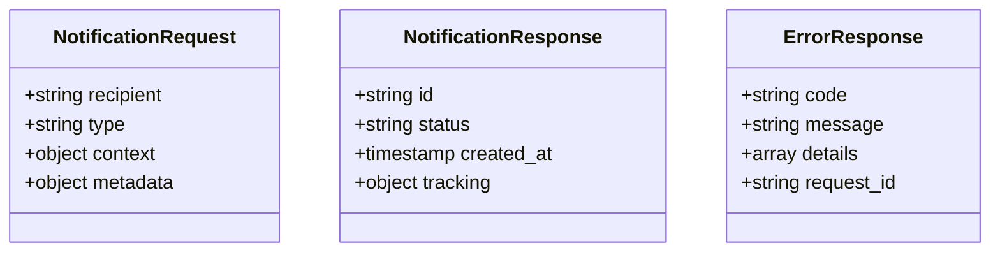
```mermaid
classDiagram
    class NotificationRequest {
        +string recipient
        +string type
        +object context
        +object metadata
    }
    
    class NotificationResponse {
        +string id
        +string status
        +timestamp created_at
        +object tracking
    }
    
    class ErrorResponse {
        +string code
        +string message
        +array details
        +string request_id
    }
```

### 3.3.4 Integration Patterns

| Pattern | Implementation | Purpose |
| --- | --- | --- |
| Circuit Breaker | - 5 failures threshold<br>- 30s reset timeout<br>- Half-open state | Vendor failure isolation |
| Retry | - Exponential backoff<br>- Max 3 attempts<br>- Jitter | Handle transient failures |
| Throttling | - Token bucket<br>- Per-client limits<br>- Burst allowance | Protect resources |

# 4. TECHNOLOGY STACK

## 4.1 PROGRAMMING LANGUAGES

| Language | Version | Component | Justification |
| --- | --- | --- | --- |
| PHP | 8.2+ | Backend Services | - Native AWS Lambda support<br>- Strong typing and attributes<br>- Extensive vendor SDKs<br>- High-performance template processing |
| TypeScript | 4.9+ | CLI Tools | - Type safety for API integration<br>- Modern async/await support<br>- Cross-platform compatibility |
| SQL | PostgreSQL 14+ | Database Queries | - Complex query optimization<br>- JSON/JSONB support<br>- Partitioning capabilities |

## 4.2 FRAMEWORKS & LIBRARIES

### Core Frameworks

| Framework | Version | Purpose | Justification |
| --- | --- | --- | --- |
| Symfony | 6.x | API Development | - Robust queue handling<br>- Built-in template engine<br>- Comprehensive testing tools |
| Symfony Components | 6.x | Core Services | - High-performance components<br>- AWS integration<br>- Vendor-agnostic design |
| PHPUnit | 10.x | Testing | - Comprehensive test coverage<br>- Parallel test execution<br>- Mock object support |

### Supporting Libraries

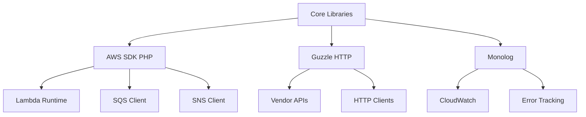
```mermaid
graph TD
    A[Core Libraries] --> B[AWS SDK PHP]
    A --> C[Guzzle HTTP]
    A --> D[Monolog]
    
    B --> E[Lambda Runtime]
    B --> F[SQS Client]
    B --> G[SNS Client]
    
    C --> H[Vendor APIs]
    C --> I[HTTP Clients]
    
    D --> J[CloudWatch]
    D --> K[Error Tracking]
```

## 4.3 DATABASES & STORAGE

### Primary Database

| Component | Technology | Configuration |
| --- | --- | --- |
| RDBMS | PostgreSQL 14+ | - Multi-AZ deployment<br>- Read replicas<br>- Point-in-time recovery |
| Connection Pool | PgBouncer | - Connection pooling<br>- Statement pooling<br>- Transaction pooling |
| Extensions | TimescaleDB | - Time-series data<br>- Automated partitioning<br>- Continuous aggregates |

### Caching Layer

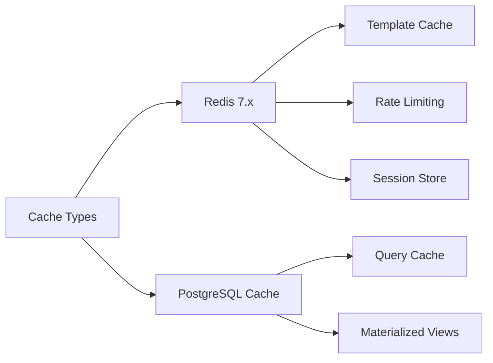
```mermaid
graph LR
    A[Cache Types] --> B[Redis 7.x]
    A --> C[PostgreSQL Cache]
    
    B --> D[Template Cache]
    B --> E[Rate Limiting]
    B --> F[Session Store]
    
    C --> G[Query Cache]
    C --> H[Materialized Views]
```

## 4.4 THIRD-PARTY SERVICES

### Notification Vendors

| Service | Integration | Purpose |
| --- | --- | --- |
| Iterable | REST API v1 | Primary email delivery |
| SendGrid | API v3 | Secondary email delivery |
| Amazon SES | AWS SDK | Fallback email delivery |
| Telnyx | REST API v2 | Primary SMS delivery |
| Twilio | API v2 | Secondary SMS delivery |

### AWS Services

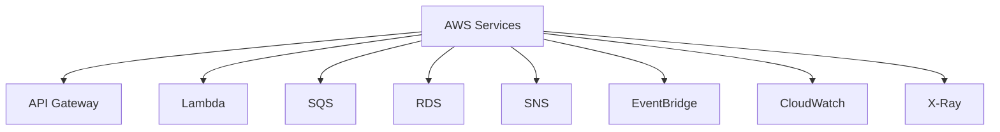
```mermaid
graph TD
    A[AWS Services] --> B[API Gateway]
    A --> C[Lambda]
    A --> D[SQS]
    A --> E[RDS]
    A --> F[SNS]
    A --> G[EventBridge]
    A --> H[CloudWatch]
    A --> I[X-Ray]
```

## 4.5 DEVELOPMENT & DEPLOYMENT

### Development Tools

| Tool | Version | Purpose |
| --- | --- | --- |
| Docker | 20.x+ | Local development |
| Terraform | 1.5+ | Infrastructure as Code |
| Composer | 2.x | PHP dependency management |
| PHPStan | 1.x | Static analysis |

### Deployment Pipeline

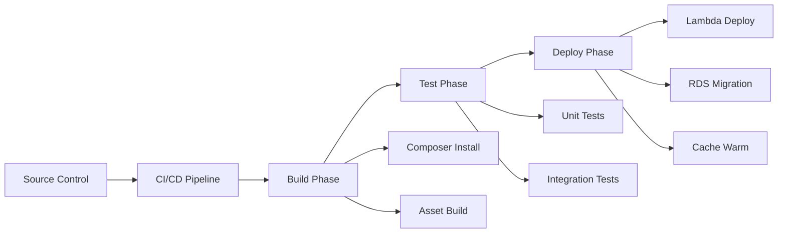
```mermaid
graph LR
    A[Source Control] --> B[CI/CD Pipeline]
    B --> C[Build Phase]
    C --> D[Test Phase]
    D --> E[Deploy Phase]
    
    C --> F[Composer Install]
    C --> G[Asset Build]
    
    D --> H[Unit Tests]
    D --> I[Integration Tests]
    
    E --> J[Lambda Deploy]
    E --> K[RDS Migration]
    E --> L[Cache Warm]
```

### Infrastructure Components

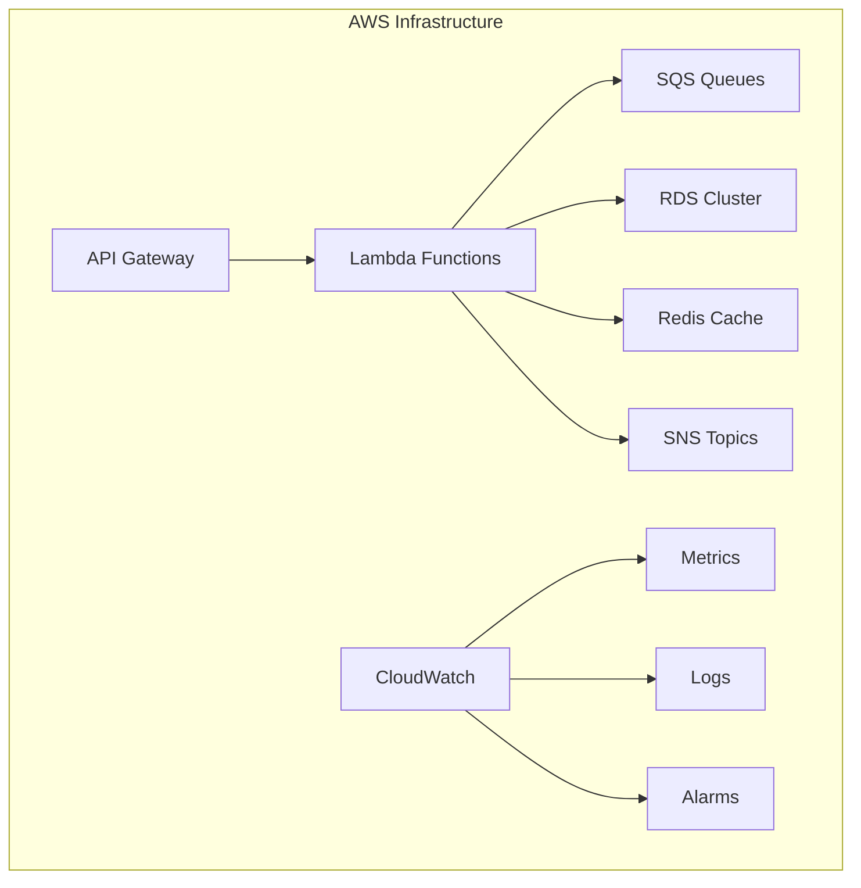
```mermaid
graph TD
    subgraph AWS Infrastructure
        A[API Gateway] --> B[Lambda Functions]
        B --> C[SQS Queues]
        B --> D[RDS Cluster]
        B --> E[Redis Cache]
        B --> F[SNS Topics]
        
        G[CloudWatch] --> H[Metrics]
        G --> I[Logs]
        G --> J[Alarms]
    end
```

### Security Components

| Component | Implementation | Purpose |
| --- | --- | --- |
| WAF | AWS WAF | API protection |
| Secrets | AWS Secrets Manager | Credential management |
| Encryption | AWS KMS | Data encryption |
| IAM | AWS IAM | Access control |

# 5. SYSTEM DESIGN

## 5.1 USER INTERFACE DESIGN

### 5.1.1 CLI Application Design

The notification service provides a command-line interface for administrative tasks and testing.

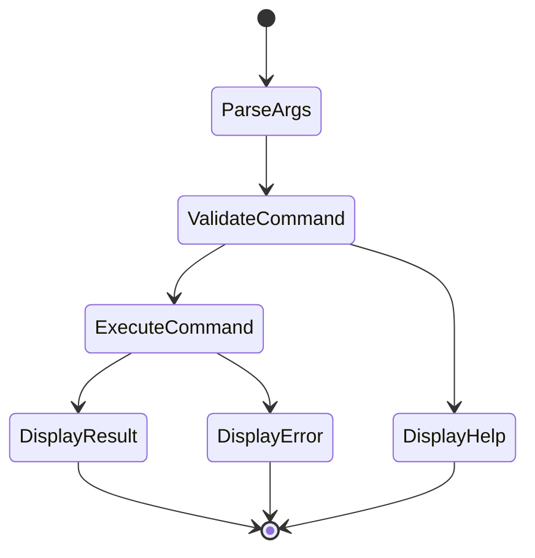
```mermaid
stateDiagram-v2
    [*] --> ParseArgs
    ParseArgs --> ValidateCommand
    ValidateCommand --> ExecuteCommand
    ExecuteCommand --> DisplayResult
    DisplayResult --> [*]
    
    ValidateCommand --> DisplayHelp
    DisplayHelp --> [*]
    
    ExecuteCommand --> DisplayError
    DisplayError --> [*]
```

#### Command Structure

| Command | Description | Example |
| --- | --- | --- |
| `notify send` | Send a notification | `notify send --template welcome --to user@example.com` |
| `notify template list` | List available templates | `notify template list --type email` |
| `notify status` | Check notification status | `notify status --id abc123` |
| `notify vendor status` | Check vendor health | `notify vendor status --service email` |

#### Output Formats

| Format | Flag | Example Output |
| --- | --- | --- |
| JSON | `--format json` | `{"status": "sent", "id": "abc123"}` |
| Table | `--format table` | Formatted ASCII table |
| Plain | `--format plain` | Simple text output |

## 5.2 DATABASE DESIGN

### 5.2.1 Schema Design

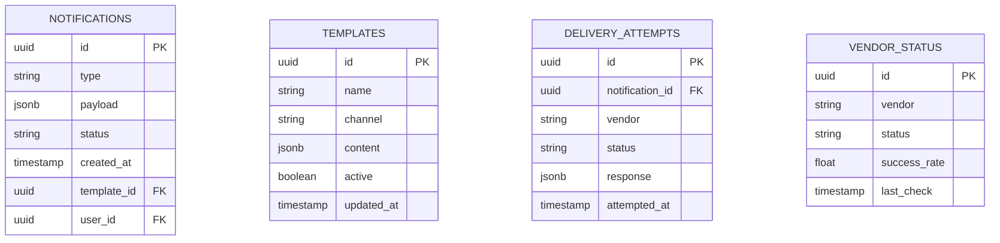
```mermaid
erDiagram
    NOTIFICATIONS {
        uuid id PK
        string type
        jsonb payload
        string status
        timestamp created_at
        uuid template_id FK
        uuid user_id FK
    }
    
    TEMPLATES {
        uuid id PK
        string name
        string channel
        jsonb content
        boolean active
        timestamp updated_at
    }
    
    DELIVERY_ATTEMPTS {
        uuid id PK
        uuid notification_id FK
        string vendor
        string status
        jsonb response
        timestamp attempted_at
    }
    
    VENDOR_STATUS {
        uuid id PK
        string vendor
        string status
        float success_rate
        timestamp last_check
    }
```

### 5.2.2 Indexing Strategy

| Table | Index | Type | Purpose |
| --- | --- | --- | --- |
| notifications | (created_at, status) | BRIN | Range queries |
| notifications | (user_id) | BTREE | User lookups |
| delivery_attempts | (notification_id, attempted_at) | BTREE | Status tracking |
| templates | (name, channel) | BTREE | Template lookups |

### 5.2.3 Partitioning Strategy

| Table | Partition Key | Retention | Strategy |
| --- | --- | --- | --- |
| notifications | created_at | 90 days | Monthly partitions |
| delivery_attempts | attempted_at | 30 days | Daily partitions |
| vendor_status | N/A | Current only | No partitioning |

## 5.3 API DESIGN

### 5.3.1 RESTful Endpoints

| Endpoint | Method | Purpose | Rate Limit |
| --- | --- | --- | --- |
| `/v1/notifications` | POST | Submit notification | 1000/min |
| `/v1/notifications/{id}` | GET | Get status | 2000/min |
| `/v1/templates` | POST | Create template | 100/min |
| `/v1/templates/{id}` | PUT | Update template | 100/min |

### 5.3.2 Request/Response Flow

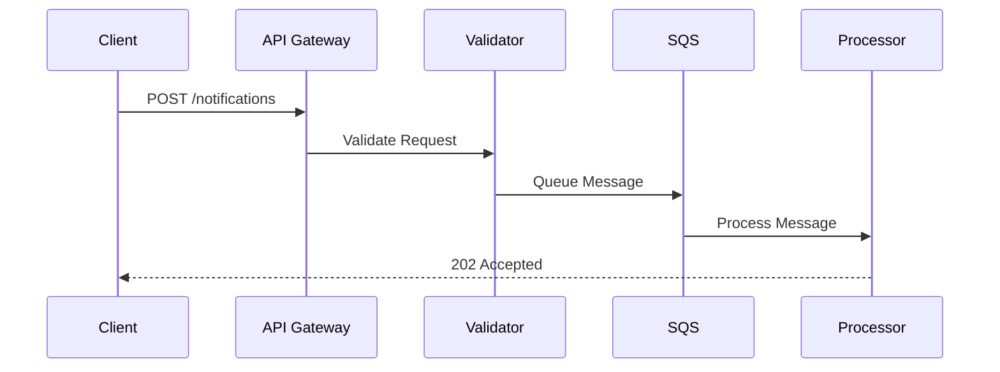
```mermaid
sequenceDiagram
    participant C as Client
    participant A as API Gateway
    participant V as Validator
    participant Q as SQS
    participant P as Processor
    
    C->>A: POST /notifications
    A->>V: Validate Request
    V->>Q: Queue Message
    Q->>P: Process Message
    P-->>C: 202 Accepted
```

### 5.3.3 Data Models

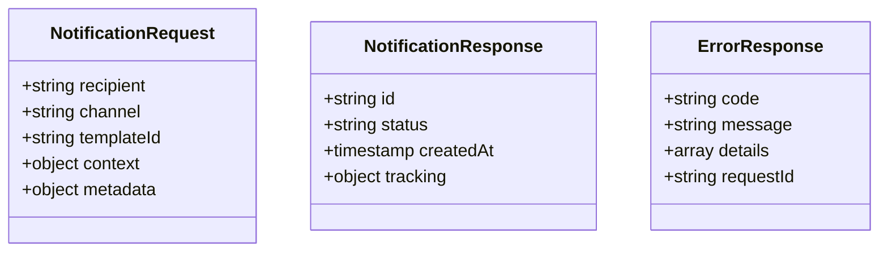
```mermaid
classDiagram
    class NotificationRequest {
        +string recipient
        +string channel
        +string templateId
        +object context
        +object metadata
    }
    
    class NotificationResponse {
        +string id
        +string status
        +timestamp createdAt
        +object tracking
    }
    
    class ErrorResponse {
        +string code
        +string message
        +array details
        +string requestId
    }
```

### 5.3.4 Error Handling

| Error Code | HTTP Status | Description | Retry |
| --- | --- | --- | --- |
| INVALID_REQUEST | 400 | Malformed request | No |
| RATE_LIMITED | 429 | Too many requests | Yes |
| VENDOR_ERROR | 502 | Vendor unavailable | Yes |
| TEMPLATE_ERROR | 422 | Template processing failed | No |

### 5.3.5 Authentication

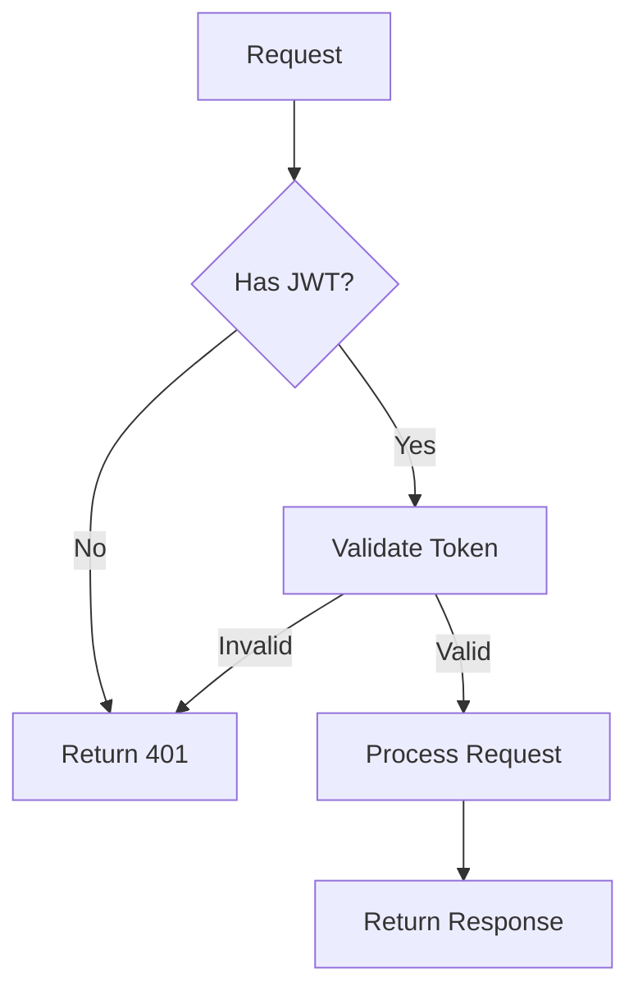
```mermaid
flowchart TD
    A[Request] --> B{Has JWT?}
    B -->|Yes| C[Validate Token]
    B -->|No| D[Return 401]
    C -->|Valid| E[Process Request]
    C -->|Invalid| D
    E --> F[Return Response]
```

### 5.3.6 Rate Limiting

| Scope | Limit | Window | Burst |
| --- | --- | --- | --- |
| IP Address | 1000 | 1 minute | 100 |
| API Key | 10000 | 1 minute | 1000 |
| Template Creation | 100 | 1 hour | 10 |
| Vendor Endpoint | 500 | 1 minute | 50 |

# 6. USER INTERFACE DESIGN

## 6.1 Administrative Dashboard

### 6.1.1 Dashboard Layout

```
+----------------------------------------------------------+
|  [#] Notification Service Admin                    [@] [=] |
+----------------------------------------------------------+
|                                                           |
|  +------------------+  +------------------+               |
|  | Active Messages  |  | Vendor Status    |               |
|  | [====     ] 45%  |  | Iterable    [UP] |               |
|  | 45,232 / 100,000 |  | SendGrid   [UP] |               |
|  +------------------+  | Twilio     [!!] |               |
|                       | Telnyx     [UP] |               |
|  +------------------+ +------------------+               |
|  | Delivery Rate    |                                    |
|  | [========] 98.2% |  [View Details >]                  |
|  +------------------+                                    |
|                                                           |
+----------------------------------------------------------+
```

### 6.1.2 Template Management Interface

```
+----------------------------------------------------------+
|  Templates                                    [+] New      |
+----------------------------------------------------------+
| Search: [...............]  Type: [v] All                  |
|                                                           |
| +----------------------------------------------------+   |
| | Name          | Type  | Status    | Last Modified   |   |
| |---------------+-------+-----------+----------------|   |
| | Welcome Email | Email | Active    | 2023-10-01     |   |
| | Password Reset| Email | Active    | 2023-09-28     |   |
| | SMS Verify    | SMS   | Draft     | 2023-09-27     |   |
| | Push Alert    | Push  | Inactive  | 2023-09-25     |   |
| +----------------------------------------------------+   |
|                                                           |
| [< Prev]                 Page 1 of 4           [Next >]   |
+----------------------------------------------------------+
```

### 6.1.3 Notification Monitor

```
+----------------------------------------------------------+
|  Live Notifications                        [!] Alert Rules |
+----------------------------------------------------------+
|                                                           |
| Status:  ( ) All  (•) Failed  ( ) Pending  ( ) Delivered |
|                                                           |
| +----------------------------------------------------+   |
| | Time     | Type | Recipient      | Status    | Retry|   |
| |---------+------+----------------+----------+-------|   |
| | 10:45:02| Email| user@test.com  | [x] Failed| [^] 2|   |
| | 10:44:58| SMS  | +1234567890    | [✓] Sent  |     |   |
| | 10:44:45| Push | device_id_123  | [•] Pending|    |   |
| +----------------------------------------------------+   |
|                                                           |
| [Refresh] [Export CSV]                                    |
+----------------------------------------------------------+
```

### 6.1.4 Vendor Configuration

```
+----------------------------------------------------------+
|  Vendor Settings                              [?] Help     |
+----------------------------------------------------------+
|                                                           |
| Email Providers:                                          |
| +--------------------------------------------------+     |
| | Iterable                                          |     |
| | API Key: [...............................] [Test] |     |
| | Weight: [v] 40%    Status: [Active v]            |     |
| +--------------------------------------------------+     |
|                                                           |
| | SendGrid                                         |     |
| | API Key: [...............................] [Test] |     |
| | Weight: [v] 60%    Status: [Active v]            |     |
| +--------------------------------------------------+     |
|                                                           |
| [Save Changes]                    [Restore Defaults]      |
+----------------------------------------------------------+
```

## 6.2 Symbol Key

| Symbol | Meaning |
| --- | --- |
| \[#\] | Dashboard/Menu icon |
| \[@\] | User profile |
| \[=\] | Settings |
| \[!!\] | Warning/Alert |
| \[UP\] | Service up status |
| \[\>\] | Navigation/Action |
| \[+\] | Add new item |
| \[x\] | Failed/Error |
| \[✓\] | Success/Completed |
| \[•\] | Pending/In Progress |
| \[^\] | Retry count |
| \[?\] | Help |
| \[...\] | Text input field |
| \[v\] | Dropdown menu |
| \[====\] | Progress bar |
| ( ) | Radio button |
| \[Button\] | Action button |

## 6.3 Interaction Flows

```mermaid
flowchart TD
    A[Dashboard Home] --> B[Template Management]
    A --> C[Notification Monitor]
    A --> D[Vendor Configuration]
    
    B --> B1[Create Template]
    B --> B2[Edit Template]
    B --> B3[Delete Template]
    
    C --> C1[View Details]
    C --> C2[Export Data]
    C --> C3[Configure Alerts]
    
    D --> D1[Add Vendor]
    D --> D2[Test Connection]
    D --> D3[Update Settings]
```

## 6.4 Responsive Design Breakpoints

| Breakpoint | Width | Layout Adjustments |
| --- | --- | --- |
| Desktop | ≥1200px | Full layout with sidebars |
| Tablet | ≥768px | Collapsed sidebar, responsive tables |
| Mobile | \<768px | Single column, stacked components |

## 6.5 Color Scheme

| Element | Color Code | Usage |
| --- | --- | --- |
| Primary | #0066CC | Headers, buttons |
| Success | #28A745 | Status indicators |
| Warning | #FFC107 | Alerts |
| Error | #DC3545 | Error states |
| Neutral | #6C757D | Secondary text |

## 6.6 Typography

| Element | Font | Size | Weight |
| --- | --- | --- | --- |
| Headers | Inter | 24px | 600 |
| Body | Inter | 14px | 400 |
| Labels | Inter | 12px | 500 |
| Buttons | Inter | 14px | 600 |

# 7. SECURITY CONSIDERATIONS

## 7.1 AUTHENTICATION AND AUTHORIZATION

### Authentication Methods

| Method | Use Case | Implementation |
| --- | --- | --- |
| JWT Bearer Tokens | API Access | - RS256 signing algorithm<br>- 1-hour expiration<br>- Refresh token rotation |
| IAM Roles | AWS Services | - Least privilege principle<br>- Service-linked roles<br>- Resource-based policies |
| API Keys | Vendor Integration | - Encrypted storage in Secrets Manager<br>- Automatic rotation every 90 days<br>- Key-per-environment |

### Authorization Matrix

| Role | Notifications | Templates | Reports | Settings |
| --- | --- | --- | --- | --- |
| Admin | Full Access | Full Access | Full Access | Full Access |
| Developer | Send, Read | Read | Read | None |
| Service Account | Send Only | Read | None | None |
| Auditor | Read Only | Read | Full Access | None |

```mermaid
flowchart TD
    A[Request] --> B{Has Token?}
    B -->|No| C[401 Unauthorized]
    B -->|Yes| D{Validate JWT}
    D -->|Invalid| C
    D -->|Valid| E{Check Permissions}
    E -->|Denied| F[403 Forbidden]
    E -->|Allowed| G[Process Request]
```

## 7.2 DATA SECURITY

### Encryption Standards

| Layer | Method | Key Management |
| --- | --- | --- |
| Data at Rest | AES-256-GCM | AWS KMS with automatic rotation |
| Data in Transit | TLS 1.3 | ACM-managed certificates |
| Database | RDS encryption | AWS managed keys |
| Queue Messages | SQS encryption | Customer managed keys |

### PII Handling

```mermaid
flowchart LR
    subgraph Data Processing
        A[Raw Data] --> B{Contains PII?}
        B -->|Yes| C[Apply Masking]
        B -->|No| D[Process Normally]
        C --> E[Encrypt]
        D --> E
        E --> F[Store/Transmit]
    end
```

### Data Classification

| Level | Description | Security Controls |
| --- | --- | --- |
| High | PII, Authentication Credentials | - Field-level encryption<br>- Audit logging<br>- Access restrictions |
| Medium | Templates, Delivery Status | - Object encryption<br>- Role-based access<br>- Standard logging |
| Low | Public Documentation, Metrics | - Basic access controls<br>- No encryption required |

## 7.3 SECURITY PROTOCOLS

### Network Security

```mermaid
flowchart TD
    subgraph VPC
        A[API Gateway] --> B[WAF]
        B --> C[Load Balancer]
        C --> D[Private Subnet]
        D --> E[Lambda]
        D --> F[RDS]
    end
    G[Internet] --> A
```

### Security Controls

| Control | Implementation | Monitoring |
| --- | --- | --- |
| WAF Rules | - Rate limiting<br>- SQL injection protection<br>- XSS prevention | CloudWatch Metrics |
| DDoS Protection | AWS Shield Standard | GuardDuty |
| IP Allowlisting | Security Group Rules | VPC Flow Logs |
| Request Validation | JSON Schema Validation | API Gateway Logs |

### Audit Trail

| Event Type | Data Captured | Retention |
| --- | --- | --- |
| Authentication | - Timestamp<br>- IP Address<br>- User ID<br>- Success/Failure | 1 year |
| Authorization | - Resource accessed<br>- Action attempted<br>- Decision | 1 year |
| Data Access | - Record ID<br>- Operation type<br>- User context | 90 days |

### Security Monitoring

```mermaid
flowchart LR
    subgraph Security Monitoring
        A[CloudWatch] --> B[Security Events]
        B --> C{Severity}
        C -->|High| D[Immediate Alert]
        C -->|Medium| E[Daily Report]
        C -->|Low| F[Weekly Summary]
        D & E & F --> G[Security Team]
    end
```

### Incident Response

| Phase | Actions | Responsible Team |
| --- | --- | --- |
| Detection | - Log analysis<br>- Anomaly detection<br>- Alert triggering | Security Operations |
| Containment | - Service isolation<br>- Token revocation<br>- Access restriction | DevOps & Security |
| Eradication | - Vulnerability patching<br>- Configuration updates<br>- System hardening | Development & DevOps |
| Recovery | - Service restoration<br>- Data validation<br>- Monitor for recurrence | Operations |

# 8. INFRASTRUCTURE

## 8.1 DEPLOYMENT ENVIRONMENT

The Notification Service is deployed entirely on AWS cloud infrastructure using a multi-account strategy for separation of concerns.

| Environment | AWS Account Purpose | Region | Backup Region |
| --- | --- | --- | --- |
| Production | Primary workload | us-east-1 | us-west-2 |
| Staging | Pre-production testing | us-east-1 | N/A |
| Development | Development and testing | us-east-1 | N/A |
| Shared Services | Monitoring, logging, security | us-east-1 | us-west-2 |

```mermaid
flowchart TD
    subgraph Production
        A[API Gateway] --> B[Lambda Functions]
        B --> C[RDS Primary]
        C --> D[RDS Replica]
        B --> E[SQS Queues]
    end
    
    subgraph DR[Disaster Recovery]
        C -.-> F[Cross-Region Replica]
        E -.-> G[Queue Replication]
    end
    
    subgraph Shared
        H[CloudWatch]
        I[Security Hub]
        J[AWS Organizations]
    end
```

## 8.2 CLOUD SERVICES

| Service | Usage | Configuration |
| --- | --- | --- |
| AWS Lambda | Message processing | Memory: 512MB<br>Timeout: 30s<br>Runtime: PHP 8.2 |
| Amazon RDS | Data persistence | Instance: db.r6g.xlarge<br>Multi-AZ: Yes<br>Engine: PostgreSQL 14 |
| Amazon SQS | Message queuing | Type: Standard<br>Retention: 14 days<br>DLQ: Enabled |
| AWS API Gateway | REST API endpoint | Type: HTTP API<br>Authentication: JWT<br>WAF: Enabled |
| Amazon ElastiCache | Caching layer | Engine: Redis 7.x<br>Instance: cache.r6g.large<br>Multi-AZ: Yes |
| AWS EventBridge | Event routing | Custom bus: Enabled<br>Archive: 30 days |

## 8.3 CONTAINERIZATION

The system utilizes containerization for local development and Lambda deployment packages.

```mermaid
graph TD
    subgraph Container Architecture
        A[Base PHP Image] --> B[Lambda Layer]
        B --> C[Function Container]
        
        D[Development Image] --> E[Local Environment]
        D --> F[CI/CD Pipeline]
    end
```

| Image | Purpose | Base Image |
| --- | --- | --- |
| php-lambda-base | Lambda runtime layer | amazon/aws-lambda-php:8.2 |
| notification-service | Function container | php-lambda-base |
| dev-environment | Local development | php:8.2-fpm-alpine |

## 8.4 ORCHESTRATION

While traditional container orchestration is not required due to the serverless architecture, AWS services provide orchestration capabilities:

| Component | Service | Configuration |
| --- | --- | --- |
| Function Orchestration | AWS Step Functions | Retry logic, error handling |
| Queue Processing | Lambda Event Source Mapping | Batch size: 10, concurrent: 5 |
| API Routing | API Gateway | Custom domain, throttling |
| Cache Management | ElastiCache Auto Discovery | Automatic node management |

## 8.5 CI/CD PIPELINE

```mermaid
flowchart LR
    subgraph Pipeline
        A[Source] --> B[Build]
        B --> C[Test]
        C --> D[Security Scan]
        D --> E[Deploy Staging]
        E --> F[Integration Tests]
        F --> G[Deploy Production]
    end
```

### Pipeline Stages

| Stage | Tools | Actions |
| --- | --- | --- |
| Source | GitHub | Code checkout, dependency scanning |
| Build | Composer, Docker | Dependency installation, container builds |
| Test | PHPUnit, PHPStan | Unit tests, static analysis |
| Security Scan | SonarQube, OWASP | Code security analysis |
| Deploy Staging | Terraform | Infrastructure deployment |
| Integration Tests | Postman, Newman | API testing |
| Deploy Production | Terraform | Blue-green deployment |

### Deployment Configuration

```mermaid
flowchart TD
    subgraph Deployment Strategy
        A[Code Merge] --> B{Auto Deploy?}
        B -->|Yes| C[Staging Deploy]
        B -->|No| D[Manual Approval]
        C --> E[Integration Tests]
        E -->|Pass| F[Production Deploy]
        E -->|Fail| G[Rollback]
        F --> H[Health Check]
        H -->|Pass| I[Complete]
        H -->|Fail| G
    end
```

### Infrastructure as Code

| Component | Tool | Purpose |
| --- | --- | --- |
| Infrastructure | Terraform | AWS resource provisioning |
| Configuration | AWS SSM | Parameter management |
| Secrets | AWS Secrets Manager | Credential management |
| Monitoring | Terraform | CloudWatch configuration |

# 8. APPENDICES

## 8.1 ADDITIONAL TECHNICAL INFORMATION

### Template Processing Details

```mermaid
flowchart TD
    A[Raw Template] --> B[Parse Variables]
    B --> C[Load Language Pack]
    C --> D[Apply Context Data]
    D --> E{Template Type}
    E -->|Email| F[Generate HTML]
    E -->|Email| G[Generate Text]
    F & G --> H[Email Package]
    E -->|SMS| I[Generate Plain Text]
    E -->|Push| J[Generate Rich Content]
    H & I & J --> K[Content Validation]
    K --> L[Delivery Queue]
```

### Vendor Failover Logic

| Priority | Email | SMS | Push |
| --- | --- | --- | --- |
| Primary | Iterable | Telnyx | AWS SNS |
| Secondary | SendGrid | Twilio | - |
| Tertiary | Amazon SES | - | - |
| Failover Time | \< 2s | \< 2s | \< 1s |
| Health Check Interval | 30s | 30s | 30s |

### Database Partitioning Strategy

| Table | Partition Type | Retention | Archival |
| --- | --- | --- | --- |
| notifications | Monthly | 90 days | S3 Cold Storage |
| delivery_attempts | Daily | 30 days | S3 Cold Storage |
| vendor_stats | Monthly | 365 days | S3 Cold Storage |
| templates | None | Indefinite | Version Control |

## 8.2 GLOSSARY

| Term | Definition |
| --- | --- |
| Asynchronous Processing | Method of handling operations independently of the main request flow |
| Circuit Breaker | Design pattern that prevents cascading failures by stopping operations when error thresholds are exceeded |
| Dead Letter Queue | Secondary queue for messages that couldn't be processed after multiple attempts |
| Eventually Consistent | Data consistency model where replicas become consistent after a period of time |
| Idempotency | Property where an operation can be repeated without changing the result |
| Round Robin | Load distribution method that cycles through available resources sequentially |
| Throttling | Technique to control the rate of resource usage or request processing |
| Webhook | HTTP callback that delivers real-time information to other applications |

## 8.3 ACRONYMS

| Acronym | Full Form |
| --- | --- |
| API | Application Programming Interface |
| AWS | Amazon Web Services |
| BRIN | Block Range Index |
| DLQ | Dead Letter Queue |
| FIFO | First In, First Out |
| IAM | Identity and Access Management |
| JSON | JavaScript Object Notation |
| JSONB | Binary JSON |
| JWT | JSON Web Token |
| PII | Personally Identifiable Information |
| RBAC | Role-Based Access Control |
| RDS | Relational Database Service |
| REST | Representational State Transfer |
| SDK | Software Development Kit |
| SES | Simple Email Service |
| SMS | Short Message Service |
| SNS | Simple Notification Service |
| SQS | Simple Queue Service |
| SSL | Secure Sockets Layer |
| TLS | Transport Layer Security |
| TTL | Time To Live |
| UTC | Coordinated Universal Time |
| VPC | Virtual Private Cloud |
| WAF | Web Application Firewall |
| YAML | YAML Ain't Markup Language |

## 8.4 REFERENCE DOCUMENTATION

| Resource | Purpose | URL |
| --- | --- | --- |
| AWS Lambda | Serverless compute documentation | https://docs.aws.amazon.com/lambda/ |
| Laravel | PHP framework documentation | https://laravel.com/docs/ |
| PostgreSQL | Database documentation | https://www.postgresql.org/docs/ |
| Terraform | Infrastructure as Code | https://www.terraform.io/docs/ |
| PHP 8.2 | Language documentation | https://www.php.net/docs.php |
| OpenAPI 3.0 | API specification | https://swagger.io/specification/ |
| AWS Best Practices | Architecture guidelines | https://aws.amazon.com/architecture/ |