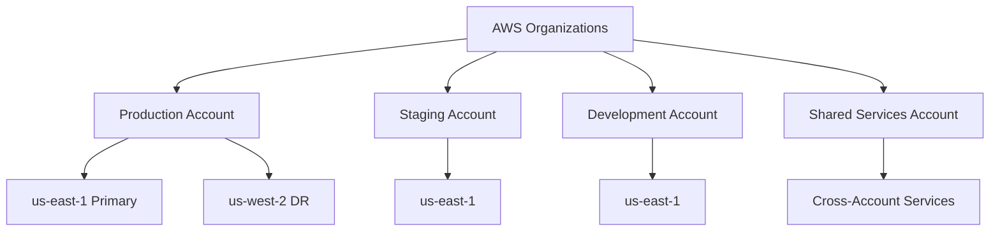
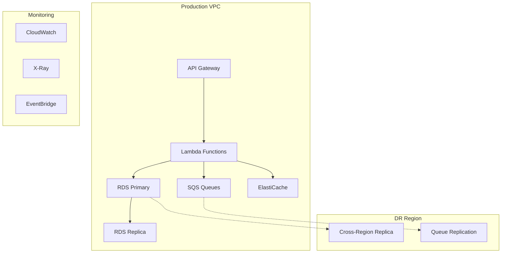
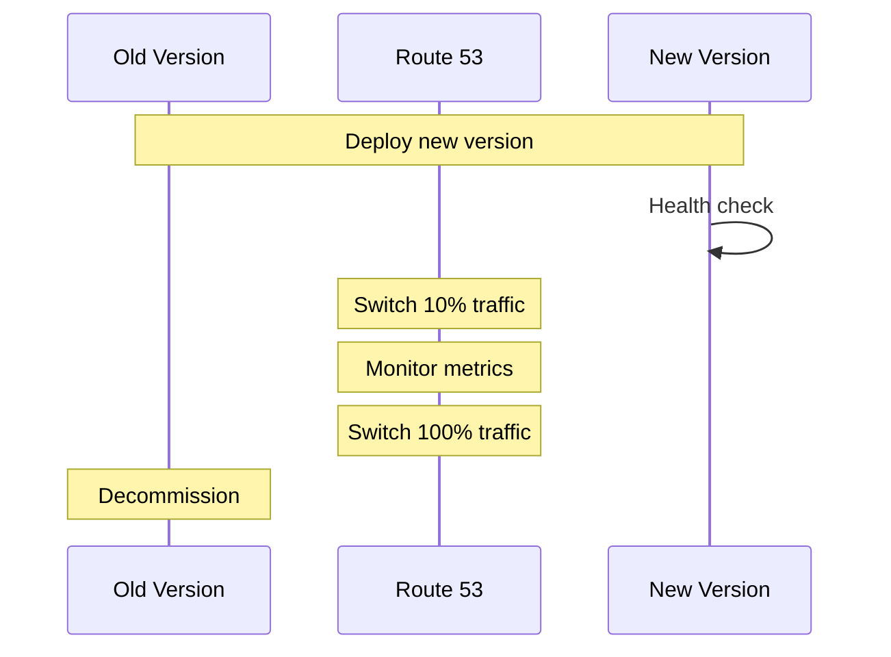
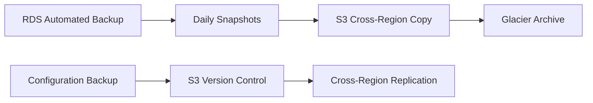
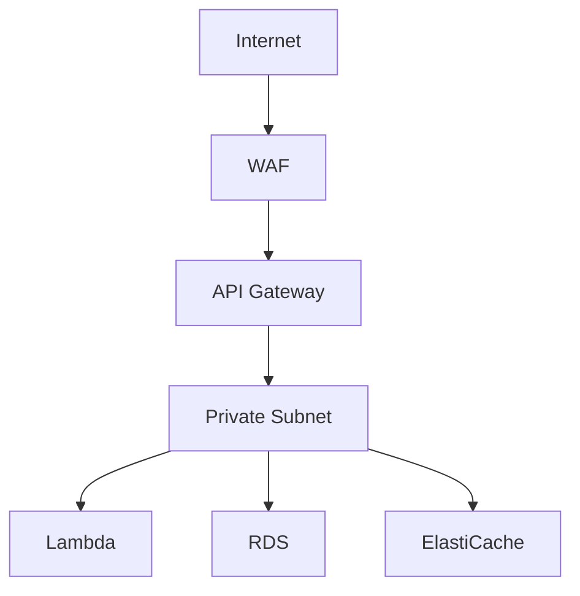

# Notification Service Infrastructure Documentation

## Table of Contents
1. [Overview](#overview)
2. [Prerequisites](#prerequisites)
3. [Infrastructure Components](#infrastructure-components)
4. [Deployment Instructions](#deployment-instructions)
5. [Environment Management](#environment-management)
6. [Monitoring and Maintenance](#monitoring-and-maintenance)
7. [Security](#security)
8. [Troubleshooting](#troubleshooting)

## Overview

The Notification Service infrastructure is designed for high-throughput message processing across multiple AWS accounts and regions. This document outlines the complete infrastructure architecture and operational procedures.

### Account Structure



### High-Level Architecture



## Prerequisites

### Required Tools and Versions

| Tool | Version | Purpose |
|------|---------|----------|
| AWS CLI | v2.x+ | AWS resource management |
| Terraform | 1.5+ | Infrastructure as Code |
| Docker | 20.x+ | Local development and builds |
| PHP | 8.2+ | Runtime environment |

### Required Permissions

- IAM role with administrative access to target accounts
- Access to AWS Secrets Manager
- Permissions to manage VPC resources
- Access to ECR repositories
- CloudWatch full access

### Network Requirements

- VPC with public and private subnets
- NAT Gateway for private subnet access
- VPC Endpoints for AWS services
- Cross-region VPC peering (for DR)

## Infrastructure Components

### Compute Resources

#### Lambda Functions
```hcl
# Configuration Reference
runtime: php-8.2
memory: 512MB
timeout: 30s
concurrency: 100
vpc_config: private_subnet
```

#### RDS Cluster
```hcl
# Configuration Reference
instance_class: db.r6g.xlarge
engine: postgres
version: 14
multi_az: true
storage: 100GB
backup_retention: 7
```

#### ElastiCache
```hcl
# Configuration Reference
node_type: cache.r6g.large
engine: redis
version: 7.x
num_cache_nodes: 2
automatic_failover: enabled
```

### Networking

| Component | Configuration | Purpose |
|-----------|--------------|----------|
| VPC | CIDR: 10.0.0.0/16 | Network isolation |
| Private Subnets | 10.0.1.0/24, 10.0.2.0/24 | Application tier |
| Public Subnets | 10.0.3.0/24, 10.0.4.0/24 | Load balancers |
| NAT Gateway | Highly available | Internet access |

## Deployment Instructions

### Initial Setup

1. Initialize Terraform workspace:
```bash
./scripts/init-terraform.sh
```

2. Configure environment variables:
```bash
export TF_VAR_environment="production"
export TF_VAR_region="us-east-1"
```

3. Deploy infrastructure:
```bash
terraform init
terraform plan
terraform apply
```

### Blue-Green Deployment



## Environment Management

### Environment Configuration Matrix

| Parameter | Production | Staging | Development |
|-----------|------------|---------|-------------|
| Instance Size | db.r6g.xlarge | db.r6g.large | db.t3.medium |
| Multi-AZ | Yes | No | No |
| Backup Retention | 7 days | 3 days | 1 day |
| Auto Scaling | Yes | Yes | No |

## Monitoring and Maintenance

### CloudWatch Metrics

| Metric | Threshold | Action |
|--------|-----------|--------|
| CPU Utilization | > 70% | Scale up |
| Queue Depth | > 1000 | Increase consumers |
| Error Rate | > 1% | Alert |
| Latency | > 500ms | Investigate |

### Backup Strategy



## Security

### Network Security Architecture



### Encryption Standards

| Resource | Encryption Type | Key Management |
|----------|----------------|----------------|
| RDS | AES-256 | AWS KMS |
| SQS | Server-Side | AWS Managed |
| Lambda ENV | KMS | Customer Managed |
| Cache | Redis AUTH | AWS Secrets Manager |

## Troubleshooting

### Common Issues and Resolution

| Issue | Symptoms | Resolution |
|-------|----------|------------|
| High Latency | Response time > 500ms | Check DB connections |
| Queue Backup | Messages > 1000 | Scale consumers |
| Memory Pressure | OOM errors | Increase Lambda memory |
| Connection Timeout | 504 errors | Check security groups |

### Support Escalation Path

1. DevOps Team (L1)
2. Cloud Infrastructure Team (L2)
3. AWS Support (Enterprise)
4. Service Owner

---

**Maintainers**: DevOps Team  
**Last Updated**: Version Controlled  
**Review Frequency**: Monthly  

For detailed AWS architecture documentation, refer to the [AWS Well-Architected Framework](https://aws.amazon.com/architecture/well-architected/).