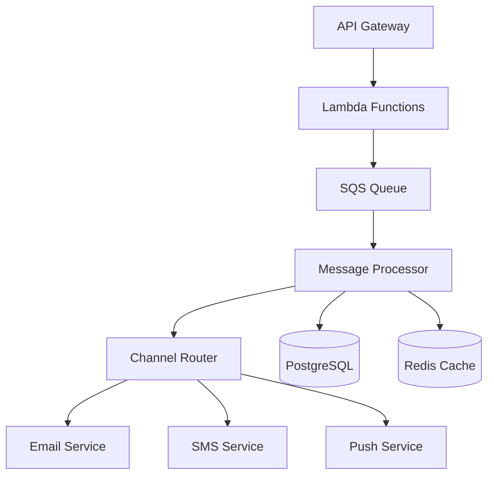

# Notification Service Backend

[](../../actions)
[](https://codecov.io/gh/organization/notification-service)

[](LICENSE)

High-throughput, multi-channel notification service designed to deliver messages at scale across Email, SMS, and Push channels.

## Key Features

- 100,000+ messages per minute throughput
- 99.9% delivery success rate
- 99.95% system uptime
- Multi-vendor failover support
- Comprehensive delivery tracking
- Enterprise-grade security

## System Architecture



## Prerequisites

- PHP 8.2 or higher
- Docker & Docker Compose
- AWS CLI with configured credentials
- Composer 2.x
- Terraform 1.5+
- PostgreSQL 14+ client

## Installation

1. Clone the repository:
```bash
git clone git@github.com:organization/notification-service.git
cd src/backend
```

2. Install dependencies:
```bash
composer install
```

3. Configure environment:
```bash
cp .env.example .env
```

4. Start local services:
```bash
docker-compose up -d
```

5. Initialize database:
```bash
php artisan migrate
php artisan db:seed
php artisan key:generate
```

## Development Setup

### Local Environment

1. Configure Docker services:
```yaml
# docker-compose.yml reference
services:
  app:
    build: .
    environment:
      - APP_ENV=local
      - DB_CONNECTION=pgsql
      - REDIS_HOST=redis
  postgres:
    image: postgres:14-alpine
  redis:
    image: redis:7-alpine
```

2. Configure vendor APIs:
- Copy `.env.example` to `.env`
- Update vendor credentials:
  - `ITERABLE_API_KEY`
  - `SENDGRID_API_KEY`
  - `TELNYX_API_KEY`
  - `AWS_SNS_KEY`

### Testing

Run test suite:
```bash
# Unit tests with coverage
composer test

# Static analysis
./vendor/bin/phpstan analyse src tests --level=max

# Code style
composer run-script check-style

# Parallel testing
./vendor/bin/pest --parallel
```

## API Documentation

### Authentication

- JWT-based authentication
- Token format: `Authorization: Bearer <token>`
- 1-hour token expiration

### Endpoints

| Method | Endpoint | Rate Limit | Description |
|--------|----------|------------|-------------|
| POST | `/v1/notifications` | 1000/min | Submit notification |
| GET | `/v1/notifications/{id}` | 2000/min | Get status |
| POST | `/v1/templates` | 100/min | Create template |
| PUT | `/v1/templates/{id}` | 100/min | Update template |

Detailed API documentation available at `/docs/api-specification.md`

## Deployment

### AWS Infrastructure

1. Configure AWS credentials:
```bash
aws configure
```

2. Deploy infrastructure:
```bash
cd terraform
terraform init
terraform plan
terraform apply
```

3. Deploy application:
```bash
php artisan deploy:lambda
php artisan warm:cache
```

### Environment Configuration

Required environment variables:
```
APP_ENV=production
APP_KEY=<generated-key>
DB_CONNECTION=pgsql
DB_HOST=<rds-endpoint>
REDIS_HOST=<elasticache-endpoint>
AWS_LAMBDA_FUNCTION_NAME=notification-processor
```

## Security

### Authentication & Authorization

- JWT-based API authentication
- IAM roles for AWS services
- Role-based access control (RBAC)

### Data Protection

- AES-256-GCM encryption at rest
- TLS 1.3 for data in transit
- AWS KMS for key management

### Audit Logging

- Comprehensive request logging
- Delivery attempt tracking
- Security event monitoring

## Contributing

Please read [CONTRIBUTING.md](CONTRIBUTING.md) for contribution guidelines and [SECURITY.md](SECURITY.md) for reporting security issues.

## Documentation

- [Technical Documentation](/docs/technical-specification.md)
- [API Documentation](/docs/api-specification.md)
- [Contributing Guidelines](CONTRIBUTING.md)
- [Security Policy](SECURITY.md)

## License

This project is licensed under the MIT License - see the [LICENSE](LICENSE) file for details.